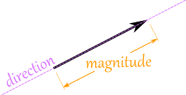
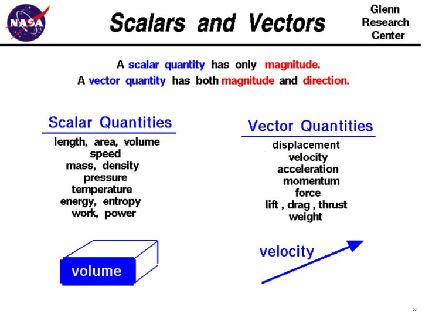

# Shooting Star
### Purpose
Learn about objects and constructors using p5js during Creative Coding Fest.

### Why?

### What to Do After the Workshop?

---

## Eat Your Cake and Have It Too
Imagine you are a baker. You walk by someone else's bakery during your mid day stroll to stretch your legs., and you see a cake. It looks absolutely fantastic and delicious. You have to find out everything you can about this cake!

**What are some questions you might ask the baker?**

## Objects
An object is a **thing**. You get to decide what that thing is. This **thing** begins to take shape when you describe it. Well, how are you supposed to describe it? You describe it in your program by attaching data (numbers, words, even other objects!) to it. Every thing in our known universe has certain qualities that define what it is. Take a ball for example. A ball:

1) has a color
2) has a size
3) can be bouncy or not bouncy
4) has an owner

Now think, what **types** of data would we attach to these qualities of our ball?

1) p5 color (maybe a string or a number...but we're using p5js so pah!)
2) number
3) boolean
4) string (maybe a person object?!)

All this data belongs to our *ball object*. We can create a single *ball object* or many *ball objects*. Each one we make could be different, or they can all be the same. It's up to you and the purpose behind making these *ball objects*. You are the creator of these things. Make them as crazy and wacky (or as boring and neutral) as you'd like.

Just how things have qualities, they have reactions and interactions. If you drop your newly created ball, what happens?! Does it bounce? Does it roll on the uneven floor beneath it? Does it phase through the floor (because it is a ghost ball)? Does it burst into a bouquet of flowers? Its up to you!

For our purposes, the object's actions and interactions are all created and defined inside the constructor (more on this in a bit). You can access these functions by putting a dot after the name of our object followed by the name of the function (make sure there are no spaces!). Accessing the action of our ball would look like this:

`ball.bounce();`

Accessing an object's qualities (its color, size, etc.) is accessed the same way:

`ball.color`.

## Constructors
A constructor is a **special function**, which every object is created from, but is a function nonetheless. The constructor is where you define an object. It is where you give all the numbers, strings, and booleans a relation to each other.

Since we are using JavaScript, we have to signal our need to create an object with our constructor function. That signal is the *new* keyword.

Let's go back to our ball object. Here's an example of what our constructor for the ball object could look like:

```javascript
function Ball(xposition, yposition, size_){
  this.x = xposition;
  this.y = yposition;
  this.size = size_;
}
```

Great, we have our constructor function!

Right now, it saves some information. Not very interesting, but crucial!

What does the *this* keyword refer to?
How would we create an object with this?


```javascript
//underneath our Ball constructor!
var b1 = new Ball(100,100,20);
```

Awesome, and now we have a ball object!

---

Let's talk about the *this* keyword for a moment.

The *this* keyword refers to the object we are talking about. If we are dealing with our `b1` object above, the *this* keyword in our constructor **refers to the** `b1` **object**. If we create an object called `b2`, the *this* keyword **refers to the** `b2` **object**.

---

Here's how we can access some of it's data (it's attributes):

```javascript
//normal javascript style:
console.log(b1.x);
console.log(b1.y);
console.log(b1.size);

//or in processing style:
ellipse(b1.x, b1.y, b1.size, b1.size);
```

So, we now know how to:
- create a constructor
- create an object using the constructor and the *new* keyword
- access the attributes of an object

Creating functions for an object is pretty easy, and we will explore that while we build up our shooting stars objects.

---

## Creating A Shooting Star

### The Star Constructor
Here's our ball class from earlier:

```javascript
function Ball(xposition, yposition, size_){
  this.x = xposition;
  this.y = yposition;
  this.size = size_;
}
```

We're going to change it up a bit to make our lives easier and to make sure our shooting stars act accurately.

```javascript
function Star(x_, y_, diameter_){
    this.position = createVector(x, y);
    this.velocity = createVector(random(2,5), random(-10,-5));
    this.accel = createVector(0,0);
    this.diameter = diameter_;
}
```

A few things changed, such as the name of the constructor, the parameters, and the names of the attributes. Make sure you double check everything!

Here's the breakdown.

We create a vector called *position* (what's a vector?! more on this soon) that has an initial x and y component of the `x_` and `y_` passed to the constructor.

Then, we create another vector called *velocity* with an initial x component of any number between 2 and 5 and a y component of any number between -10 and -5.

We create a third vector called *accel* (for acceleration) with an initial x and y component of 0.

We then set the *diameter* of our Star to the `diameter_` that we passed to the constructor.

### Vectors!

A vector is defined as "a quantity having **direction** as well as **magnitude**, especially as determining the position of one point in space relative to another". What does that mean?



Here are some comparisons:



### Adding Functions

```javascript
//this will go in a file called 'stars.js'

function Star(x_, y_, diameter_){
    this.position = createVector(x_, y_);
    this.velocity = createVector(random(2,5), random(-10,-5));
    this.accel = createVector(0,0);
    this.diameter = diameter_;

    //our functions go below here!
    this.applyForce = function(force){
        this.accel.add(force)
    };//end applyForce()

    this.update = function(){
        this.velocity.add(this.accel);
        this.position.add(this.velocity);
        this.accel.mult(0);
    }

    this.display = function(){
        fill(255);
        noStroke();
        ellipse(this.position.x, this.position.y, this.diameter, this.diameter);
        this.update();
    }
    //our functions go above here!
}
```

Okay, that was kind of a lot! Let's break it down.

We created three functions: `applyForce()`, `update()`, and `display()`.

*applyForce* takes one parameter. It adds the parameter to our *accel* vector.

*update* takes no parameters. It adds the acceleration to the velocity, which then gets added to the position; then, it nullifies the acceleration by multiplying *accel* by 0. We do this so the acceleration does not compound and get out of control!

*display* takes no parameters. It sets the fill color of our star, and turns the stroke off as well. We then draw an ellipse of size *diameter* at the x and y component of the vector *position*. Finally we call the update function. Viola, se fine. Well, almost.

We now need to create our first star object!

### First Star Object
```javascript
//below the Star constructor

//declaring the variable that contains the object, do not initialize a value
var star1;
//declare a variable that will be a vector that constantly points down, to act like gravity
//do not initialize it
var gravity;

//our always necessary and wonderful setup() and draw() functions
function setup(){
    createCanvas(400,400);//creating a square canvas
    gravity = createVector(0, 0.2);//create a vector, set to gravity variable
    //creating the object
    star1 = new Star(10, 300, 20);//set the object to star1 variable
}

function draw(){
    background(0);//set to black
    star1.applyForce(gravity);
    star1.display();
}
```
Let's break this down.

In `setup()`, we create a canvas to draw on. We then create a vector that constantly points down, which acts like gravity in this world of ours. We then create a Star object and set it to `star1`, which is a global variable and we can access it anywhere in our program.

In `draw()`, we set the background to 0, and later on we'll change it to add in some star trails! For now though, its a deep, dark black. We then apply gravity to our `star1`. Finally, we call `star1`'s function `display()` which creates an ellipse and moves it on its merry way.

## Creating Many Shooting Stars

Okay, we can create a single shooting star. Great!

Now we're going to take it further.

We're going to accomplish a few things here:
- create multiple stars based off of an event (key press or mouse press)
- keep track of multiple stars
- create an explosion of stars from a single star, when it reaches a certain point

Let's get started.

### Create Multiple Stars
Outside of our Star constructor, make sure your code looks like this:

```javascript
var star1;
var gravity;
var stars = []; //an uninitialized array of stars!

//our always necessary and wonderful setup() and draw() functions
function setup(){
    createCanvas(400,400);//creating a square canvas
    gravity = createVector(0, 0.2);//create a vector, set to gravity variable
    //creating the object
    star1 = new Star(10, 300, 20);//set the object to star1 variable

    //we're going to use a for loop

}

function draw(){
    background(0);//set to black
    star1.applyForce(gravity);
    star1.display();

    //for loops!
    for(var i = 0; i < stars.length; i++){
        stars[i].applyForce(gravity);
        stars[i].display();
    }//end of the for loop
}//end of draw()

function mouseReleased(){
    stars.push(new Star(random(10,50), random(200,300), 20));
    console.log("mouse");
}//end of mouseReleased()
```

Here's the breakdown.

We added two chunks of code. We added a for loop and a function called `mouseReleased()`.

You can read up on the [mouseReleased](https://p5js.org/reference/#/p5/mouseReleased) function.

Our for loop does two things. It applies gravity to all the star objects in our `stars[]` array. It also calls each star object's `display()` function.

Now onto the event where we create and add more star objects to our `stars[]` array.

`mouseReleased()` will create a new Star object and add it to the end of our `stars[]` array. That's what *push* is for. It is a function of all arrays (they're really lists and not arrays, but humor for a bit :P). *push* adds whatever data is inside the parenthesis to the end of the array, in this case its the `stars[]` array.

Click on the canvas and see what happens!

### Adding the Explosion
Okay bear with me here. We're going to overhaul some of the code to create some explosions.

We're going to make each star object explode into 100 or so tinier star objects when it reaches roughly the middle of the screen.

Ready. Set. Go.

```javascript
//inside our Star constructor

function Star(x_, y_, diameter_){

    this.position = createVector(x_, y_);
    this.velocity = createVector(random(2,5), random(-10,-5));
    this.accel = createVector(0,0);
    this.diameter = diameter_;
    this.explode = false;//added this!
    this.dust = [];//added this!

    //added this!:
    this.createDust = function(){
        for(var i = 0; i < 5; i++){
            this.dust[i] = new Star((random(-30,30)+this.position.x), (random(-30,30)+this.position.y), 5);
        }//end for loop
    }//end createDust()

    this.applyForce = function(force){
        this.accel.add(force)
    };//end applyForce()

    this.update = function(){
        this.velocity.add(this.accel);
        this.position.add(this.velocity);
        this.accel.mult(0);
        //updated from here!
        //if the star reaches the half point of the screen
        if(this.position.x >= width/2){
            this.explode = true;//set our explosion boolean to true
        }
        if(this.position.y > height){
            this.explode = false;
        }
        //if our star has reach the half point of the screen
        if(this.explode){
            this.createDust();//run the createDust() function
            for(var i = 0; i < this.dust.length; i++){
            //apply all the necessary forces as per our original Star functions
                this.dust[i].velocity.add(this.accel);
                this.dust[i].position.add(this.velocity);
                this.dust[i].accel.mult(0);
            }//end for loop
        }
        //updated until here!
    };//end update()

    this.display = function(){
        fill(255);
        noStroke();
        this.update();
        //updated from here!
        //if our original Star object has reached half point of the screen
        if(this.explode){
            for(var i = 0; i < this.dust.length; i++){
                //draw all the dust (little stars) in the array of dust[]
                ellipse(this.dust[i].position.x, this.dust[i].position.y, this.dust[i].diameter, this.dust[i].diameter);
            }
        }
        //if our original star hasn't reached half point of the screen
        if(!this.explode){
            //draw only the original star
            ellipse(this.position.x, this.position.y, this.diameter, this.diameter);
        }//updated until here!
    };//end display()
}//end Star()

//setup() and draw() below here!
```
